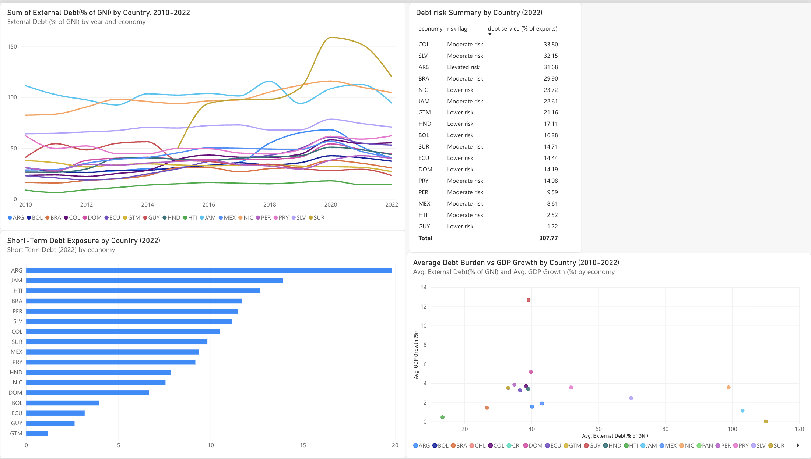

# Latin American Sovereign Debt Risk Dashboard

**A SQL- and Power BI-driven screen of external debt risk across 17 Latin American and Caribbean economies (2010–2022).**

## Key Finding

Debt risk in the region is multidimensional — the country with the highest overall debt burden (Suriname) is not the same country with the highest refinancing risk (Argentina) or the highest debt-service strain (Colombia). A single debt-to-GDP ranking would miss all of this. The analysis also finds no simple region-wide relationship between debt burden and GDP growth — the most extreme data point (Guyana) is explained by a country-specific event (its 2020-onward offshore oil boom) rather than a general pattern.

## Dashboard

*(Built in Power BI. Interactive .pbix file not included since it was built on a school-managed account; screenshot above reflects the finished, interactive version.)*

## Data & Method

- **Source:** World Bank International Debt Statistics & World Development Indicators, pulled via the `wbgapi` Python package
- **Sample:** 17 LAC economies, 2010–2022
- **Pipeline:** Python → SQLite database → SQL queries (including window functions for year-over-year change) → exported dataset → Power BI dashboard
- **Indicators:** External debt (% of GNI), short-term debt (% of total external debt), debt service (% of exports), GDP growth, inflation

## SQL Queries

The analysis is built on four core queries (see the notebook for full SQL):
1. Current debt burden ranking by country
2. Year-over-year change in debt service burden (window function)
3. Refinancing risk classification (short-term debt exposure, flagged Low/Moderate/Elevated)
4. Debt burden vs. GDP growth, country-level averages

## Files

- [`lac_debt_sql_powerbi.ipynb`](./lac_debt_sql_powerbi.ipynb) — full pipeline: data pull, SQL database creation, all four queries, Power BI export
- [`debt_risk_brief.md`](./debt_risk_brief.md) — full written findings brief
- `dashboard_screenshot.png` — screenshot of the finished Power BI dashboard

## Caveats

This is a public-data risk screen, not a full sovereign credit analysis — it does not account for currency composition of debt, maturity profiles beyond short/long-term, or market access. See the full brief for details.
